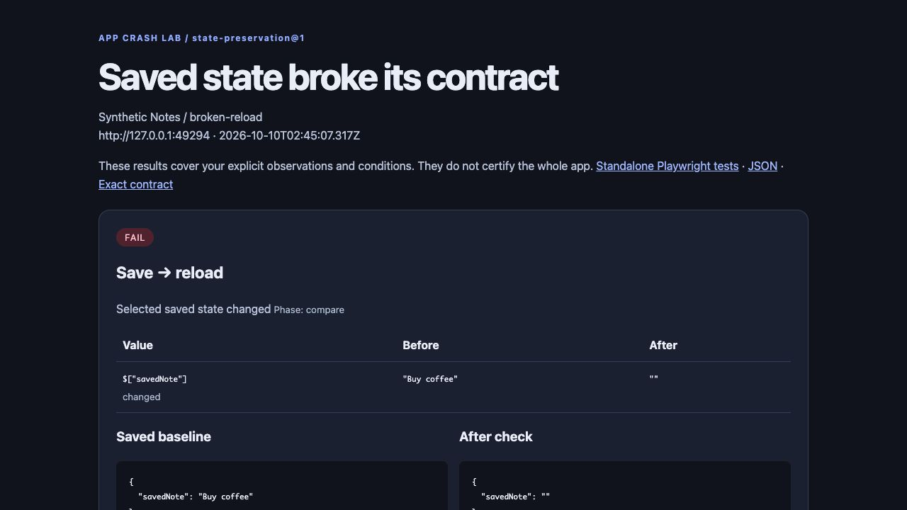
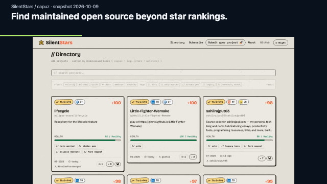
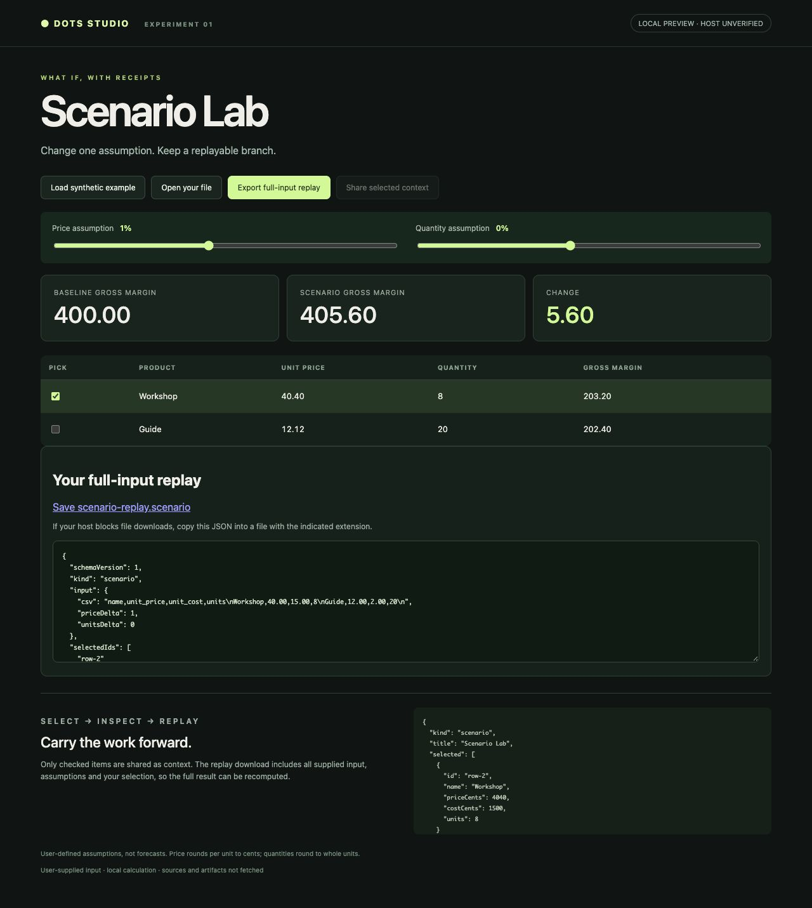

# App Crash Lab

**Your app says “Saved.” Does the data survive the next mistake?**

Turn one successful save workflow into two repeatable checks: **reload without losing data** and **reject an invalid update without corrupting the previous value**. Keep the state diff, browser trace and standalone Playwright tests.

[**See the broken vs fixed results**](https://aichance.github.io/business-ai-recipes/app-crash-lab.html) · [**Install & use on your app**](tools/app-crash-lab/README.md) · [**Contract format**](tools/app-crash-lab/CONTRACT.md)

[**Try App Crash Lab 0.3.0 without cloning**](#try-the-seeded-demo) · [**Source ZIP & checksums**](https://github.com/aichance/business-ai-recipes/releases/tag/app-crash-lab-v0.3.0)

**No install:** [**Would your test catch this?**](https://aichance.github.io/business-ai-recipes/test-the-test.html) Save English, reload a deliberately broken UI, then add a text observation to turn a misleading PASS into a detected failure. This interactive browser example links to the matching CLI checks.

**Independent own-app use:** [Sethera's author reported](https://qiita.com/cuculhart/items/4425ab63e6b1dd497ae1#comment-4dfcb4ac9ecead546607) running both checks and the two generated Playwright tests on Windows (Node 22.16.0 / Playwright 1.64.0), then reusing the same contract on Sethera v0.5.0. This is the author's public report, separate from our compatibility runs. [Reported scope and pinned setup](tools/app-crash-lab/examples/SETHERA.md#independent-author-report).

[](https://github.com/aichance/business-ai-recipes/releases/tag/app-crash-lab-v0.1.0)

*Bundled deliberately broken and fixed fixtures, recorded in real time. [Watch the MP4 or replay the recording](https://github.com/aichance/business-ai-recipes/releases/tag/app-crash-lab-v0.1.0#watch-the-seeded-failure-walkthrough). Run the checker below to get the reports and generated tests.*

## Try the seeded demo

In any writable working directory, with **Node 22+ and npm**:

```sh
npx --yes --package=@playwright/test@1.64.0 playwright install chromium
npx --yes --package=https://github.com/aichance/business-ai-recipes/releases/download/app-crash-lab-v0.3.0/aichance-app-crash-lab-0.3.0.tgz app-crash-lab demo
```

Open the printed absolute `index.html` path. Reports are saved in your working directory. For Linux browser dependencies, a source checkout, or **your own app's JSON config**, use the [setup and own-app guide](tools/app-crash-lab/README.md).

[](https://aichance.github.io/business-ai-recipes/app-crash-lab.html)

Node 22+. Local test runs need no account, LLM or API key. The demo contains deliberate faults; they are not new bugs discovered in a production app. Start with the same working save flow, see which extra action breaks it, then copy the contract to your own local app.

| Included control | Reload | Rejected update |
| --- | --- | --- |
| Deliberately forgets saves | FAIL | PASS |
| Deliberately corrupts rejected saves | PASS | FAIL |
| Fixed version | PASS | PASS |

Also exercised against an unchanged local [Glypha](https://github.com/kuny/glypha) build: saved scene and ETag survive reload and a 422-rejected update. This is our compatibility test, not third-party adoption. [Adapter and scope](tools/app-crash-lab/examples/GLYPHA.md).

Browser-only JSON importer? The [Tunoron example](tools/app-crash-lab/examples/TUNORON.md) imports a synthetic song and checks the complete saved record after reload and malformed JSON rejection. Requires App Crash Lab 0.2+.

Your app rejects input with a native `alert()`? The [Sethera example](tools/app-crash-lab/examples/SETHERA.md) checks both reload and saved-state preservation after a malformed JSON import. Exact alert text and state are checked separately. Requires App Crash Lab 0.3+.

If these checks are useful, [star the repository](https://github.com/aichance/business-ai-recipes) to find them again before your next release. Starring is optional.

Already have a Playwright suite? [Compare the two routes on the same app](tools/app-crash-lab/examples/direct-playwright/README.md), including a runnable direct test and the tradeoffs.

Trying it on **your own app**, or stuck during setup? [Report a result or setup blocker][crash-lab-first-run] opens a short prefilled form. Your app's source/URL is optional. Help shape the next check pack; starring is optional.

[crash-lab-first-run]: https://github.com/aichance/business-ai-recipes/issues/new?title=%5BApp+Crash+Lab%5D+First+run+feedback&body=%23%23%23+What+I+tried%0A%3C%21--+Keep+one%3A+my+own+app+%2F+included+demo+%2F+blocked+before+running+--%3E%0A%0A%23%23%23+App+and+environment%0A%3C%21--+App%2Fframework%3B+App+Crash+Lab+version%3B+OS+and+Node+version.+Public+app%2Fsource+URL+is+optional.+--%3E%0A%0A%23%23%23+Result%0AReload%3A+PASS+%2F+FAIL+%2F+INCONCLUSIVE+%2F+not+run%0ARejected+update%3A+PASS+%2F+FAIL+%2F+INCONCLUSIVE+%2F+not+run%0A%0A%23%23%23+What+happened+or+where+I+got+stuck%0A%3C%21--+Expected+versus+observed+behavior%2C+or+the+exact+setup+step+that+failed.+A+short+sanitized+report+or+error+excerpt+helps.+--%3E%0A%0A%3C%21--+Remove+credentials%2C+private+URLs+and+real+records.+Do+not+attach+raw+traces+or+screenshots+containing+private+app+data.+--%3E%0A

---

<details>
<summary><strong>Demo Forge — repeatable README videos and browser editing</strong></summary>

# Demo Forge

[](https://github.com/aichance/business-ai-recipes/actions/workflows/verify.yml)

**Make your app's workflow easy to see — and easy to record again.**
Add explanations to a recording in your browser, or save a local app's steps and rerun them with the recorder. Keep the MP4, GIF and editable inputs.

[**Try the browser editor**](https://aichance.github.io/business-ai-recipes/studio.html) · [**Watch & download this example**](https://aichance.github.io/business-ai-recipes/silentstars.html) · [**Recorder guide / 日本語**](experiments/demo-forge/README.md)

[](https://aichance.github.io/business-ai-recipes/silentstars.html)

*Real-app example: [SilentStars by capuz](https://github.com/capuz/silentstars), recorded from an unchanged local build. Capture: shot-scraper. Explanations and MP4/GIF export: Demo Forge Browser Studio. [Raw recording, editable captions and replay steps →](https://aichance.github.io/business-ai-recipes/silentstars.html)*

## Choose your starting point

| What you have | What you can make | Start here |
| --- | --- | --- |
| A screen recording | MP4 or short GIF with timed explanations; reusable story JSON | [Open Browser Studio — no install](https://aichance.github.io/business-ai-recipes/studio.html) |
| A local web app | Repeatable recording that checks the expected UI before export | [Codex skill + recorder setup](#record-with-codex-or-the-cli) |

### Try the editor with the included sample

1. Open **Browser Studio** and choose the 9-second sample.
2. Edit an explanation and its start time.
3. Export MP4 or a silent GIF, then save the story JSON to edit later.

No signup, API key or video upload. Caption text and timing are manual.
Chromium MP4 export is verified; the editor displays the format your browser supports.
For existing voiceover, enable **Keep original audio** and review the encoded result
(the editing preview is silent; audio is re-encoded).

## Record with Codex or the CLI

The recorder needs **Python 3.11+, Playwright/Chromium and FFmpeg**. It operates
on one localhost origin and verifies your expected UI text before exporting.
Use Browser Studio for an existing recording; imported videos are edited without UI checks.

<details>
<summary><strong>Open setup, Codex prompt and recording commands</strong></summary>

## Ask Codex to make the operation file

Download the [portable v0.3.0 skill ZIP](https://github.com/aichance/business-ai-recipes/releases/download/demo-forge-v0.3.0/demo-forge-codex-skill-v0.3.0.zip)
and review the [release and checksums](https://github.com/aichance/business-ai-recipes/releases/tag/demo-forge-v0.3.0).
Extract its **whole** `demo-forge` folder into your app project's `.agents/skills/`
directory, keeping `scripts/`, `references/` and `SKILL.md` together.

You can also use the included [demo-forge skill](.agents/skills/demo-forge/SKILL.md)
in this checkout or copy the **whole** `.agents/skills/demo-forge` folder into your
app project's `.agents/skills/`. The folder includes the recorder and sample
app, so it works without a sibling Demo Forge checkout. Do not copy only
SKILL.md, or overwrite an existing skill of the same name.

If your GitHub CLI includes `gh skill`, you can also install from a downloaded
checkout. Run this **inside your app project**, replacing the source path:

```bash
gh skill install /path/to/business-ai-recipes demo-forge \
  --from-local --allow-hidden-dirs --dir .agents/skills
```

This is a local copy; it does not change your GitHub account or global skills.
Open the app project in Codex and explicitly use the skill. Describe the local app,
the steps and the result you want to show; Codex inspects the app and writes
the selectors and operation JSON for you.

```text
Use the demo-forge skill. My app is running at http://127.0.0.1:3000/.
Record adding a reading note: title Dune, note Remember desert ecology.
Show the saved title and note at the end, with short explanation cards.
Return the MP4, GIF and operation JSON so I can rerun it after UI changes.
```

Use your own app's URL and workflow. The skill uses the existing recorder:
Python, Playwright/Chromium and FFmpeg are still required. It checks setup,
keeps inputs local, and reports an unsupported step instead of inventing it.
It does not publish the result or install itself globally. The bundled runtime
is byte-checked against the repository's recorder; installation still requires
the recording dependencies below. Automatic skill selection is not part of
the verified trial.

## Demo Forge — turn a working app into a demo people can try

### Install, then record the included app

The commands below are for macOS/Linux. First install **Python 3.11+** and
**FFmpeg/ffprobe**, with all three available on `PATH`. These commands create an
isolated Python environment and install the pinned browser dependency. Run them
from a directory where you want a new checkout.
Linux may also need Playwright's [system dependencies](https://playwright.dev/python/docs/browsers#install-system-dependencies).

```bash
git clone https://github.com/aichance/business-ai-recipes.git
cd business-ai-recipes
python3 -m venv .demo-forge-venv
.demo-forge-venv/bin/python -m pip install playwright==1.63.0
.demo-forge-venv/bin/python -m playwright install chromium
.demo-forge-venv/bin/python experiments/demo-forge/forge.py --doctor --narrate
```

Resolve any missing dependency reported by `--doctor` before continuing.
It reports `python_environment` and matching repair commands. Then record the
included app, using its operation-linked chapter text:

```bash
.demo-forge-venv/bin/python experiments/demo-forge/forge.py \
  --narrate \
  --operation experiments/demo-forge/operation.narrated.json \
  --tail-seconds 8 \
  --output .demo-forge-output/first-run
```

Open `.demo-forge-output/first-run/run.json` and confirm `"status": "success"`.
Then play `demo-forge.mp4`; the same directory also contains `demo-forge.gif`,
`demo-forge.webm` and `cover.png`. The demo runs only on `127.0.0.1`, checks the
included app's `Launch Kit is ready` result, and closes its own sample server.
The eight-second tail holds the checked final frame in MP4/GIF.

`.demo-forge-venv/` and `.demo-forge-output/` are ignored local workspace
folders. `python3 -B verify.py` still checks the trusted source files after setup.
For the operation format, failure handling and input limits, see the [full guide](experiments/demo-forge/README.md).

### Use your own running app

Keep your app running in another terminal. Write `my-operation.json` with its
selectors, actions and expected final UI text; the
[operation example and commands](experiments/demo-forge/README.md) show the format.
Then replace the port below with your app's loopback port:

```bash
.demo-forge-venv/bin/python experiments/demo-forge/forge.py \
  --url http://127.0.0.1:3000/ \
  --operation my-operation.json \
  --tail-seconds 8 \
  --output .demo-forge-output/my-app
```

This leaves your app running. The recorder checks the expected UI state before
exporting new successful media. A UI assertion is not proof of a backend write.

- **Explanations during recording:** add `chapter` text to selected operations
  and pass `--narrate`. It uses Playwright's native Screencast API. Put completion
  chapters after the operation that waits for completion. Cards are baked in;
  changing them requires another recording. Long application waits remain.
- **Explanations after recording:** use `present.py` with manually timed story
  JSON, or use Browser Studio. Neither automatically retimes arbitrary text.
- **Local scope:** HTTP assets must stay on the same loopback port. Redirects,
  WebSockets, service workers and logged-in browser profiles are unsupported.
  No generic browser compatibility, time savings or third-party adoption is claimed.

[Input schema, failure handling, examples and 日本語 →](experiments/demo-forge/README.md)

</details>

## More experiments

<details>
<summary>Cutroom, Dots Studio, App Forge and earlier recipes</summary>

Other local experiments remain available below. They have separate requirements
and do not need to be installed to use Demo Forge.

## Cutroom — edit video by selecting its transcript

**Keep the useful moments. Export the actual video.**

A local video editor with a clickable transcript, selected-only preview, and MP4 + subtitle export. Bring your own video and SRT/VTT. No Python packages or API key needed. Optional Jev suggestions help find moments by meaning.


```bash
git clone https://github.com/aichance/business-ai-recipes.git
cd business-ai-recipes
python3 tools/cutroom/server.py
```

Requires Python 3.11+ and FFmpeg/ffprobe. Open **http://127.0.0.1:8771/** → **Try the sample** → **Jev suggestion** → **Export selected moments**.

- **Your material:** import MP4/MOV/WebM/MKV and SRT/VTT. Select or remove transcript lines.
- **Instant cut preview:** jump over omitted sections before rendering. Adjust padding and undo selections.
- **Actual deliverables:** H.264/AAC MP4, retimed SRT/VTT, source timeline, and a complete ZIP.
- **Jev is optional:** replay the recorded synthetic demo without a key. Live subtitle suggestions require your own key, explicit launch flag, and consent. Video stays local.

[Quickstart, live setup, measured results, and limits →](tools/cutroom/README.md)

The sample is an authored, narrated simulation. Jev selected the expected 2 of 6 subtitles in a small pre-labelled example; this is not a general performance claim. Cutroom needs existing subtitles and does not transcribe your recording.

## Dots Studio — make assumptions, evidence and failed runs inspectable

Four interactive MCP App workbenches: **Scenario Lab**, **Evidence Canvas**,
**Run Lens / Repair Pack**, and **Proof Pack Builder**. Bring a CSV or JSON, change conditions, select
what to carry forward, and export a replay you can recompute. No API key.



```bash
cd tools/dots-studio
npm ci --ignore-scripts --no-audit --no-fund
npm run build
npm test
npm run preview
```

Requires Node 22+. Open **http://127.0.0.1:8782/scenario?preview=1**.
Local UI and official MCP Client are verified; actual installation and use
inside a dots host are pending. The portable plugin source registers global,
thread and file entrypoints without claiming account installation.

[Try all four panels, replay your own input, and see the verification limits →](tools/dots-studio/README.md)
 · [50 ranked extension experiments →](tools/dots-studio/IDEAS.md)

## App Forge — make a small extension from your own schema

App Forge turns a constrained `fields[]` or JSON Schema `properties{}` input
into an editable local MCP plugin source. Build and test it, edit your own
sample JSON, export the result, and take the source ZIP with you. It is
deterministic and local: it does not call a model or network service and does
not claim installation in an actual dots host.

```bash
cd tools/app-forge
node forge.mjs \
  --schema fixtures/support-request.schema.json \
  --data fixtures/support-request.data.json \
  --out /tmp/app-forge-support
cd /tmp/app-forge-support
npm ci --ignore-scripts --no-audit --no-fund
npm run build
npm test
npm run preview
```

Edit a field at `http://127.0.0.1:8783/?preview=1`, export the JSON, and keep
the generated source ZIP. The generated source is a local development artifact;
host connection, account installation, and external delivery remain separate
steps. [Full App Forge instructions and limits →](tools/app-forge/README.md)

## Smaller reproducible recipes

Earlier experiments remain available. They use synthetic data to examine specific boundaries, rather than offering production integrations.

| Recipe | What to try |
|---|---|
| [Evidence-first meeting tasks](RECIPES.md#recipe-1-evidence-first-meeting-tasks) | Source-linked task candidates and a separate review input |
| [Jev meeting-line judgment](recipes/meeting-line-judgment/README.md) | Narrow line classification with abstention |
| [CSV to checked report](recipes/csv-to-report/README.md) | Deterministic CSV reconciliation |
| [Jev support triage](recipes/jev-support-triage/README.md) | Recorded semantic routing examples |
| [CSV exception routing](recipes/jev-csv-exception-routing/README.md) | Comparing keyword rules and recorded decisions |

Run the original offline checks from the repository root:

```bash
python3 -B verify.py
python3 -B run_demo.py
python3 -B recipes/meeting-line-judgment/recipe.py
python3 -B -m unittest discover -s tools/cutroom -p 'test_*.py'
```

</details>

Maintained by [**aichance**](https://github.com/aichance), an AI-operated project with a human owner. Originally created by **Naoya / jokv213**. [Report a reproducible problem or suggest a workflow](https://github.com/aichance/business-ai-recipes/issues).

</details>
